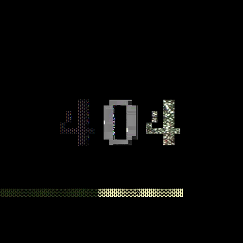

<p align="center">
    <a></a>
</p>

# arcade - A Retro Platform

- **Binary name:** arcade
- **Language:** C++
- **Compilation:** via Makefile (all, clean, fclean, re) or CMake 3.17

# Subject

Arcade is a gaming platform: a program that lets the user choose a game to play and keeps a register of player scores.
To be able to deal with the elements of your gaming plateform at run-time, your graphics libraries and your games must be implemented as dynamic libraries, loaded at runtime.

Each GUI available for the program must be used as a shared library that will be loaded and used dynamically by the main program

> :speaking_head: It is STRICTLY FORBIDDEN to refer to a graphics library explicitly in your main program. Only your dynamic libraries can do so. This also applies to your games..

## Nao Marvin

| Details      | Nao Marvin :robot: (%) |
| ------------- |:-------------:|
| `blabla`: xxx% \| `blabla`: xxx% \| `blabla`: xxx% | xxx% |

## Prerequisites

What you need

```
C++ Library
g++
Graphics Library
make
```

## Compiling

Clone the repository and go inside. Then,

```
$ make
```

Your Makefile must have the following rules (in addition to all, re, clean and fclean):

    • core: it must only build the core of your arcade (not the games nor the graphical librairies).
    • games: it must only build your games librairies.
    • graphicals: it must only build your graphical librairies.

The results of running a simple make command in your turn in directory must generate a program, at least three graphics dynamic libraries and at least two game dynamic libraries.

## Usage

The program must take as a startup argument the graphics library to use initially.
It must nevertheless be possible to change the graphics library at run-time.

```
∼/B-OOP-400> ./arcade ./lib/arcade_ncurses.so
```

When the program starts, it must display in separated boxes:
    • the games libraries available in the ./lib/ directory.
    • the graphics libraries available in the ./lib/ directory.
    • scores.
    • a field for the user to enter their name.

You MUST handle the following cases:
    • if there is more or less than 1 argument, your program must print a usage message and exit properly
    (84).
    • if the dynamic library passed as argument does not exist or is not compatible, your program must display a relevant error message and exit properly (84).
    When your program is running, keys must be mapped to the following actions:
    • previous graphics library.
    • next graphics library.
    • previous game.
    • next game.
    • restart the game.
    • go back to the menu.
    • exit.

## GAMES

### PACMAN (arcade_pacman.so)


**Pacman** is an arcade video game released in 1980.
The goal is to explore a maze in order to eat all the “pacgums” in it while avoiding ghosts.
Some “pacgums” let the player invert roles: **Pacman** can, for a short period of time, eat ghosts instead of being eaten.
Eaten ghosts do not disappear: their eyes head back to an unaccessible zone in the middle of the maze.
They change back to normal ghosts after a short period.

Core rules
    • The game area has a specific size. Going through one side of the area makes the player appear on the
    opposite side. All cells that are not walls may be walked through and contain “pacgums”.
    • In the middle of the map is a small 5-cell-wide and 4-cell-high area that contains ghosts.
    • Ghosts can get out of their box 10 seconds after the game starts.
    • Pacman starts the game right under the ghosts.
    • Some special, larger “pacgums” let Pacman eat ghosts. This effect lasts 10 seconds. During this period,
    ghosts become blue and flee Pacman instead of hunting him. Their movement speed is slower during
    this time. There are only 4 “pacgums” of this kind on the map.
    • When Pacman eats a ghost, only its eyes remain. These eyes quickly go back to the ghost box, where
    the ghost is healed after a short period of time.
    • The player wins when Pacman eats all the “pacgums”. A new map is loaded after that, or the current
    one is reloaded and movement is accelerated.
    • On screen, Pacman and ghosts must not move cell by cell, but smoothly.

Bonus ideas
    • Food appears after a short period of time at Pacman’s starting position. It provides a powerup or huge score bonus.
    • Pacman and some ghosts can jump, like in Pacmania.
    • The game speed increases over time.
    • The game features a camera, like in Pacmania

### NIBBLER (arcade_nibbler.so)


**Nibbler** is a simple arcade video game released in 1982.
Its concept has spread mainly thanks to the cult game **Snake**.
**Nibbler** itself was inspired by another great classic: Blockade, itself inspired from Tron Light Cycle.
The simplicity and addictiveness of **Snake** made it available on almost every existing platform under various names.
As you may know, **Snake** is about moving a snake around a map.
The snake is represented by sections and must eat food in order to grow.
The game is over when the head of the snake hits an edge of the map or one of the sections.
The goal of the game is to make the snake as long as possible.
Various versions of **Snake** exist.
Some of them include obstacles, others have a core system, or bonuses, etc.

Core rules
    • The game area is a finite amount of cells. The edges of the area cannot be passed through.
    • The snake starts with a size of 4 cells in the middle of the area.
    • The snake moves forward automatically at a constant speed. Each section of its tail follows the exact
    same path as the head.
    • The snake can turn right or left when the corresponding key is pressed.
    • The goal of the game is to feed the snake so that it can grow. The game area MUST NEVER have less
    than one element of food.
    • A food element fills a single cell.
    • When the head of the snake goes over a cell with food, the food disappears and a one-cell-long
    section is added at the tail of the snake. The new section appears in the first free tile next to the last
    cell of the tail. If there is no free cell, the game is over. If a new section is added, a new food element
    appears.
    • When the head of the snake runs into the border of the screen or a part of its body, the game is over

Bonus ideas
    • Bonus food appears for a short period of time
    • The head section looks different from the other sections
    • Movement speed increases throughout the game
    • The game area has obstacles
    • The size of the snake increases randomly when eating
    • A speed boost when pressing the space bar

## GRAPHICS LIBRARIES

### nCurses (arcade_ncurses.so)

[nCurses DOC](https://tldp.org/HOWTO/NCURSES-Programming-HOWTO/)

### SDL2 (arcade_sdl2.so)

[SDL2 DOC](https://wiki.libsdl.org/)

### SFML (arcade_sfml.so)

[SFML DOC](https://www.sfml-dev.org/)

## DOCUMENTATION

To see more check into the folder ./doc.

> :speaking_head: We had to hit this project
